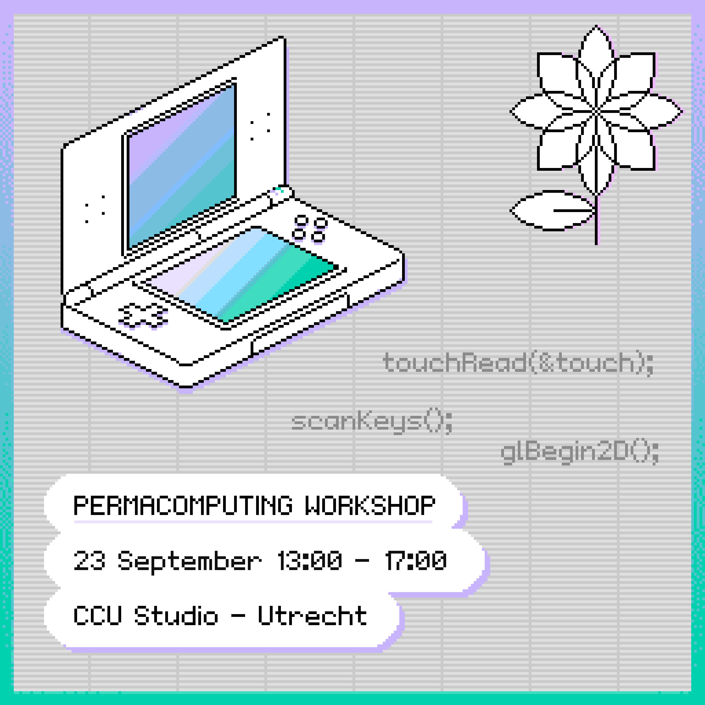
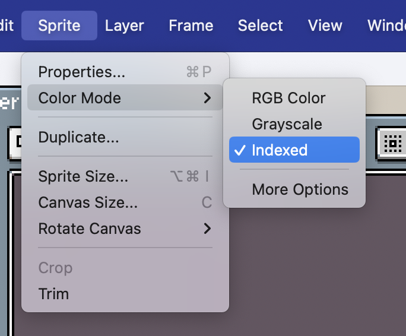

# CCU Nintendo DS Workshop



    
This workshop is part of the [Permacomputing program](https://creativecodingutrecht.nl/en/calendar/permacomputing-workshop-nintendods) at [Creative Coding Utrecht](https://creativecodingutrecht.nl/).
Nintendo DS programs are written in C or C++, but this workshop doesn't use a lot of advanced programming concepts.


## Installation

**Requirements**:
- A computer with Linux, Mac or Windows
- An IDE, this repository has been set up to work best with [Visual Studio Code](https://code.visualstudio.com/) but any text editor will do
- [devkitPro](https://devkitpro.org/wiki/Getting_Started) with `nds-dev` package installed. Installer for:
    - [Mac and Linux](https://github.com/devkitPro/pacman/releases/tag/v6.0.2)
    - [Windows](https://github.com/devkitPro/installer/releases/tag/v3.0.3)
- [Aseprite](https://www.aseprite.org/) to edit sprites and backgrounds
- [DeSmuME](https://github.com/TASEmulators/desmume/releases) or another NDS emulator
    - For Linux look [here](https://www.maketecheasier.com/desmume-play-nintendo-ds-games-linux/)
- [NightFox’s Lib](https://github.com/knightfox75/nds_nflib) to make working with graphics easier.


### Follow the instructions for your operating system:
- [Installation on Mac and Linux](./installation-mac-linux.md)
- [Installation on Windows](./installation-windows.md)


If you want intellisense on your own projects that you copied from the template, copy the .vscode folder into your project.


## Clone the repository somewhere in your computer

```bash
git clone https://github.com/goudreinette/ccu-nds-workshop
```

Open it in your editor of choice.


## Compiling a program
Go to the folder of the program you want to build.

```bash
cd demos/buttons
```

Convert images to the format used by the DS.
Do this before compiling the program.

```bash
sh ./convert-assets.sh
```

Compile the program.

```bash
make
```

To run the program in the emulator, open it from the Finder / Explorer or run it from the command line (Mac example).

```bash
open buttons.nds
```


## Making your own programs

Clone the `template` folder and rename it.
Hack away!

```bash
cp -r template my-program
```


## Graphics
The demos use the [PICO-8 palette](https://www.lexaloffle.com/pico-8.php).
When creating sprites and backgrounds, make sure that the color mode in Aseprite is set to Indexed Color.


