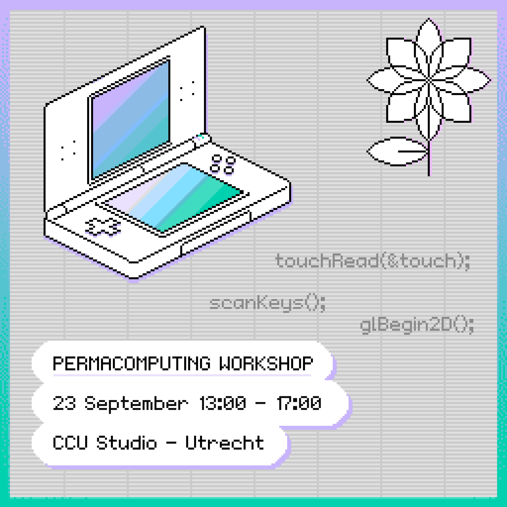

# CCU Nintendo DS Workshop





## Prerequisites

- [devkitPro](https://devkitpro.org/wiki/Getting_Started) with 
- [Aseprite](https://www.aseprite.org/)
- [DeSmuME](https://desmume.org/) or another NDS emulator


## Getting started


### Building a program
Go to the folder of the program you want to build.

```bash
cd demos/buttons
```


### Convert images to the format used by the DS
Do this before compiling the program.

```bash
sh ./convert-assets.sh
```

### Compiling 

```bash
make
```

### Running the program on the emulator

```bash
open buttons.nds
```
